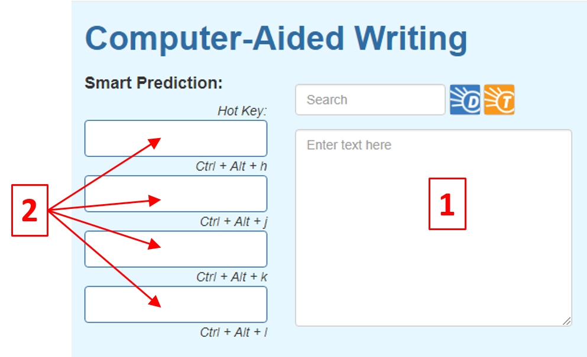
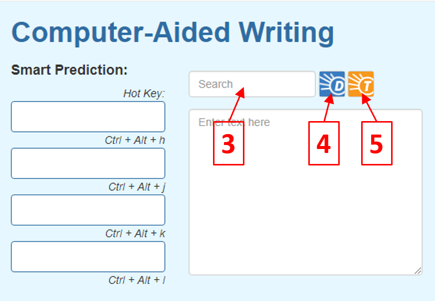

Computer-Aided Writing App
========================================================
author: Francis Labrecque (QLab.Engineering@gmail.com)
date: May 12, 2020
autosize: true

Computer-Aided Writing App
========================================================

New development in both computer and natural language processing makes it possible to quickly predict the next words or even the ending of the sentence you are currently typing. This technology can be very useful by a) speeding up writing, and b) help in avoiding making spelling mistakes.

This new app uses a large corpus of texts which are broken down into unigrams, bigrams, trigrams, and 4-grams. By tallying the frequency of appearance of those n-grams, an algorithm can then calculate the most probable next words.

Next,

- Summary of the algorithm features
- Shinyapp features

Summary of the algorithm features
========================================================

- Uses a corpus of texts of 3 different sources: Blogs, News, and Twitter.
- The corpus is composed of more than 400k sentences and more than 100k different words.
- Profanity words from a list provided by Facebook were removed from the corpus. 
- We used the "stupid backoff" smoothing technique in order to calculate the total probability.
- To offset the stopwords high probability, the probability of the next word is also calculated in the same manner from a database where the stopwords were removed. The final probability is a sum of both probabilities calculated with and without stopwords multiplied by a factor of 0.5.
- In the case of unknown words (words that are not in the corpus), the algorithm finds all the N-grams with the same sequence of known words. The probabilities of the next probable words are then calculated from that list of N-grams.

Shinyapp features
========================================================
The app user interface has been kept quite minimalistic, but still contains useful features.

- [1] is the main window where the user composes its text. The "next word" smart prediction algorithm is activated when the user enters an empty space.
- These four buttons [2] will present the four words with the highest probability of being the next word. The user can either click on the button to add the selected word at the end of the text or use the keyboard to enter the hot key shortcut indicated below each button.

***

Shinyapp features
========================================================
- The last word entered in the textbox [1] by the user will appear here [3]. The user can also enter a new word at anytime.
- This button will open a web brower to www.dictionary.com and look for the definition of the word entered in [3].
- This button will open a web brower to www.thesaurus.com and look for synonyms of the word entered in [3].

***

